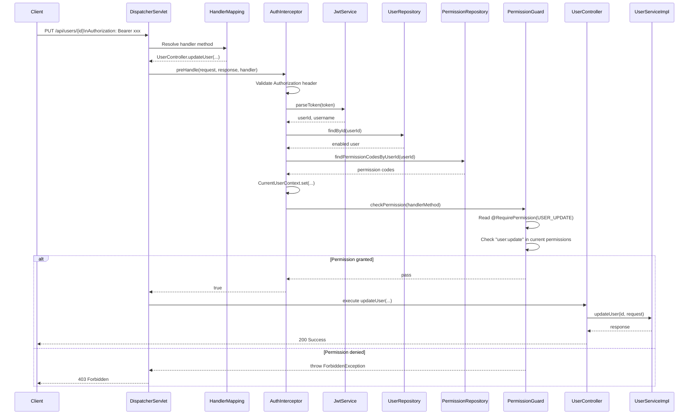
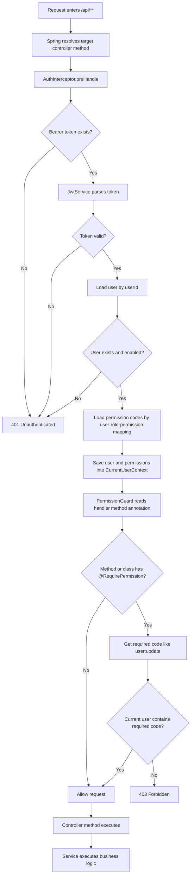

# Auth Demo Backend

A Spring Boot 3 backend demo implementing **username/password authentication**, **JWT-based authorization**, and a simple **RBAC (Role-Based Access Control)** system — built **without Spring Security**.

---

## 🚀 Project Overview

This project provides:

* Secure login with **BCrypt password hashing**
* **JWT-based authentication** for protected APIs
* User management APIs
* Role & permission management (RBAC)
* Seeded baseline data (roles & permissions)
* Unified API response format
* Centralized exception handling

> Authentication is implemented using a **custom interceptor + JWT service**.

---

## 🔐 Security Notice

* ❌ **Do NOT commit real credentials** (database, JWT secret, etc.)
* ✅ Use **environment variables** or **local config files** (ignored by Git)
* ✅ This project contains **example values only**

---

## 🧰 Tech Stack

* Java 17
* Spring Boot 3.3
* Spring Web
* Spring Data JPA
* Bean Validation
* MySQL
* JJWT
* BCrypt (`spring-security-crypto`)
* Lombok

---

## 📦 Module Structure

| Module        | Description                                |
| ------------- | ------------------------------------------ |
| `auth`        | Login, JWT generation & validation         |
| `users`       | User CRUD + role assignment                |
| `roles`       | Role CRUD + permission assignment          |
| `permissions` | Permission definitions (seeded on startup) |

---

## 🗄️ Database Setup

Create a database manually (example):

```sql
CREATE DATABASE auth_demo CHARACTER SET utf8mb4 COLLATE utf8mb4_unicode_ci;
```

> Database user and password should be configured locally and **must not be committed**.

---

## ⚙️ Configuration

### Option 1: Environment Variables (Recommended)

```bash
export DB_URL=jdbc:mysql://localhost:3306/auth_demo
export DB_USERNAME=your_username
export DB_PASSWORD=your_password
export JWT_SECRET=your_jwt_secret
```

---

### Option 2: Local Config Override

Create a local file:

```bash
src/main/resources/application-local.yml
```

```yaml
spring:
  datasource:
    url: ${DB_URL}
    username: ${DB_USERNAME}
    password: ${DB_PASSWORD}

jwt:
  secret: ${JWT_SECRET}
```

> Add this file to `.gitignore` to prevent leaks.

---

### Default `application.yml`

```yaml
spring:
  datasource:
    url: ${DB_URL:jdbc:mysql://localhost:3306/auth_demo}
    username: ${DB_USERNAME:root}
    password: ${DB_PASSWORD:}

jwt:
  secret: ${JWT_SECRET:change_me}
```

---

## ▶️ Run the Project

```bash
mvn spring-boot:run
```

Application runs at:

```
http://localhost:8080
```

---

## 🧪 Test Execution

This project uses JUnit 5 tags to separate default test coverage from longer flow-based tests.

### Test Tags

* `core`: default tests that should pass on regular `mvn test`
* `flow`: longer multi-step scenario tests that are run explicitly

### Tag Guidelines

* `core`: use for fast, stable, business-critical tests that should run by default
* `flow`: use for multi-step scenarios where one request or state change affects the next
* `manual`: use for tests that should only run when explicitly requested
* `slow`: use for tests with higher execution cost that should not block normal feedback

Rule of thumb:

* If a test is quick, stable, and essential, tag it as `core`
* If a test validates a full story or permission transition, tag it as `flow`
* If a test is mainly for debugging or special verification, tag it as `manual`
* If a test is valuable but expensive to run, tag it as `slow`

### Common Commands

Run the default core test suite:

```bash
export JAVA_HOME=/usr/local/Cellar/openjdk/23.0.2/libexec/openjdk.jdk/Contents/Home
mvn -Dmaven.repo.local=/tmp/auth-demo-m2 test
```

Run a specific test class:

```bash
export JAVA_HOME=/usr/local/Cellar/openjdk/23.0.2/libexec/openjdk.jdk/Contents/Home
mvn -Dmaven.repo.local=/tmp/auth-demo-m2 -Dtest=RbacAuthorizationIntegrationTest test
```

Run the tagged flow test explicitly:

```bash
export JAVA_HOME=/usr/local/Cellar/openjdk/23.0.2/libexec/openjdk.jdk/Contents/Home
mvn -Dmaven.repo.local=/tmp/auth-demo-m2 -Dtest=RbacAuthorizationIntegrationTest#shouldAllowCreateAfterRoleAssignmentByAnotherUser -Dtest.includedTags=flow -Dtest.excludedTags= test
```

By default, `flow`, `manual`, and `slow` tests are excluded from `mvn test`.

---

## 🧾 API Documentation

After starting the application, you can open:

* Swagger UI: `http://localhost:8080/swagger-ui.html`
* OpenAPI JSON: `http://localhost:8080/v3/api-docs`

For protected endpoints, click `Authorize` in Swagger UI and paste the JWT token returned by `POST /api/auth/login`.

---

## 🌱 Seed Data

On startup, the system initializes:

### Permissions

* `user:create`
* `user:read`
* `user:update`
* `user:delete`
* `role:create`
* `role:read`
* `role:update`
* `role:delete`

### Roles

* `ADMIN`
* `USER_MANAGER`
* `ROLE_MANAGER`

### Role Mapping

* `ADMIN` → all permissions
* `USER_MANAGER` → `user:*`
* `ROLE_MANAGER` → `role:*`

---

## 👤 Initial Access

For security reasons:

* ❌ No default password is exposed in this repository
* ✅ You should **create your own admin user manually** or via API

---

## 🔑 Authentication

### Login

```http
POST /api/auth/login
Content-Type: application/json
```

```json
{
  "username": "your_username",
  "password": "your_password"
}
```

---

### Access Protected APIs

```http
GET /api/users
Authorization: Bearer <your_token>
```

---

## 📡 API Response Format

```json
{
  "code": 0,
  "message": "Success",
  "data": {}
}
```

### Error Example

```json
{
  "code": 404,
  "message": "User not found",
  "data": null
}
```

---

## 📚 API Endpoints

### Auth

* `POST /api/auth/login`

### Users

* `POST /api/users`
* `GET /api/users/{id}`
* `GET /api/users`
* `PUT /api/users/{id}`
* `DELETE /api/users/{id}`
* `PUT /api/users/{id}/roles`

### Roles

* `POST /api/roles`
* `GET /api/roles/{id}`
* `GET /api/roles`
* `PUT /api/roles/{id}`
* `DELETE /api/roles/{id}`
* `PUT /api/roles/{id}/permissions`

---

## ⚠️ Notes

* Only `POST /api/auth/login` is publicly accessible
* All other `/api/**` endpoints require a **JWT token**
* No refresh token mechanism (simplified design)
* Spring Security is not used (custom implementation)

---

## 🔎 Method-Level Permission Flow

The most direct way to understand permission checking in this project is:

1. Spring MVC first resolves which controller method will handle the request
2. `AuthInterceptor` runs before the controller method body executes
3. The interceptor validates the token and loads the current user's permission set
4. `PermissionGuard` reads the target method's `@RequirePermission(...)`
5. If the permission is present, the request enters the controller and service
6. If the permission is missing, the request stops with `403 Forbidden`

So the order is not "enter the controller, then decide".
The real order is "resolve the controller method first, then check its permission annotation before execution".

### Request Sequence Diagram



### Method-Level Decision Flow



### What Is Checked at Method Level

For a method such as `PUT /api/users/{id}`, Spring resolves the handler as `UserController.updateUser(...)`.
That method is annotated with `@RequirePermission(PermissionCode.USER_UPDATE)`, so `PermissionGuard` converts it to the permission code `user:update` and checks whether the current user already has that code in `AuthenticatedUser.permissions`.

If the permission exists, the method body executes.
If the permission does not exist, a `ForbiddenException` is thrown before the controller method runs.

### Key Source Files

* `src/main/java/com/example/authdemo/auth/AuthInterceptor.java`
* `src/main/java/com/example/authdemo/auth/PermissionGuard.java`
* `src/main/java/com/example/authdemo/auth/RequirePermission.java`
* `src/main/java/com/example/authdemo/auth/AuthenticatedUser.java`
* `src/main/java/com/example/authdemo/repository/PermissionRepository.java`
* `src/main/java/com/example/authdemo/controller/UserController.java`
* `src/main/java/com/example/authdemo/controller/RoleController.java`

---

## 🛡️ Best Practices

* Store secrets in environment variables
* Never commit:

  * database passwords
  * JWT secrets
* Use `.gitignore` for local config files
* Rotate credentials regularly in real environments

---

## ✅ Summary

* Secure by default (no hardcoded credentials)
* Flexible configuration via environment variables
* Clean RBAC implementation
* Suitable for learning and extension
